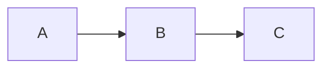

# dyno

Samostatně hostovaný dokumentační server — něco jako GitBook nebo Notion, ale jako jediný Go binární soubor bez externích závislostí.

## Co umí

- **Renderování Markdownu** — GFM, poznámky pod čarou, definiční seznamy, zvýrazňování syntaxe (200+ jazyků přes Chroma)
- **Mermaid diagramy** — vývojové diagramy, sekvenční diagramy, koláčové grafy a další
- **Fulltextové vyhledávání** — vestavěný in-memory index se zvýrazněnými úryvky
- **Automatický sidebar** — navigace se generuje z adresářové struktury, žádná konfigurace není potřeba
- **Světlý / tmavý režim** — uložen v localStorage
- **Obsah stránky** — TOC s automatickým sledováním pozice při scrollování
- **Předchozí / Další stránka** — automaticky podle pořadí v sidebaru
- **Odkaz na GitHub** — tlačítko „Upravit tuto stránku" s odkazem na repozitář
- **Bloky kódu ve stylu macOS terminálu** — terminálový chrome se zvýrazněním syntaxe
- **Tlačítko kopírovat** — jedním klikem zkopíruje obsah každého bloku kódu
- **Kotevní odkazy** — nadpisy s přímými odkazy
- **Adresáře assetů** — adresáře s prefixem `_` (např. `_images/`) servírují soubory, ale nezobrazují se v sidebaru
- **Konfigurovatelný base path** — server lze spustit pod libovolnou URL cestou (`/docs`, `/moje/docs` nebo `/`)
- **Hot reload** — příznak `--watch` přenačte navigaci a vyhledávací index při změně souborů
- **Dev režim** — příznak `--dev` načítá šablony z disku bez nutnosti rebuildu
- **Jediný binární soubor** — vše je embedováno, žádný Node.js, žádný build pipeline

## Struktura projektu

```
.
├── dyno.yaml          # Konfigurace webu
├── site/              # Sem patří Markdown obsah
│   ├── index.md       # Úvodní stránka
│   ├── getting-started/
│   │   ├── index.md
│   │   ├── _images/   # Assety (podtržítko = skryto v sidebaru)
│   │   └── ...
│   └── ...
```

## Konfigurace

Soubor `dyno.yaml` v kořenovém adresáři projektu:

```yaml
title: Moje dokumentace
description: Dokumentace projektu
version: 1.0.0
logo_text: MujProjekt
github_url: https://github.com/org/repo
github_branch: main
copyright: Moje organizace
base_path: /docs   # nebo "" pro root
```

Všechna pole jsou volitelná — dyno funguje i bez konfiguračního souboru.

## Sestavení

Vyžaduje **Go 1.22+**.

### macOS

```bash
git clone https://github.com/mares/dyno
cd dyno
go build -o dyno .
./dyno --dir /cesta/k/dokumentaci
```

Nebo přímo nainstalovat:

```bash
go install github.com/mares/dyno@latest
```

### Linux

```bash
git clone https://github.com/mares/dyno
cd dyno
go build -o dyno .
./dyno --dir /cesta/k/dokumentaci
```

Cross-kompilace z macOS/Windows:

```bash
GOOS=linux GOARCH=amd64 go build -o dyno-linux-amd64 .
```

### Windows

```powershell
git clone https://github.com/mares/dyno
cd dyno
go build -o dyno.exe .
.\dyno.exe --dir C:\cesta\k\dokumentaci
```

Cross-kompilace z macOS/Linux:

```bash
GOOS=windows GOARCH=amd64 go build -o dyno-windows-amd64.exe .
```

## Použití

```
dyno [příznaky]

Příznaky:
  -p, --port string   Port (výchozí "3000")
  -d, --dir string    Adresář obsahující složku site/ (výchozí ".")
      --dev           Načítá šablony z disku při každém požadavku
      --watch         Sleduje site/ a přenačítá navigaci a vyhledávání
      --version       Vypíše verzi a skončí
```

### Příklady

```bash
# Spustit v aktuálním adresáři
dyno

# Spustit konkrétní adresář na portu 8080
dyno --dir /cesta/k/dokumentaci --port 8080

# Vývojový režim s live reload
dyno --dev --watch
```

## Psaní obsahu

Markdown soubory patří do adresáře `site/`. Sidebar se generuje automaticky z adresářové struktury.

- Adresáře se stanou záhlavími sekcí
- Soubory se stanou stránkami
- Číselný prefix v názvu řídí pořadí: `01-uvod.md`, `02-instalace/`
- `index.md` uvnitř adresáře se stane úvodní stránkou dané sekce
- Adresáře s prefixem `_` jsou skryty v sidebaru, ale jejich soubory jsou stále dostupné (vhodné pro obrázky)

**Odkazy mezi stránkami:**

```markdown
[Relativní odkaz](../jina-stranka/)
[Absolutní odkaz](/getting-started/)    <!-- base_path se doplní automaticky -->
```

**Obrázky:**

```markdown

```

**Mermaid diagramy:**

````markdown

````

## Licence

MIT — viz [LICENSE](LICENSE).
