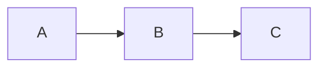

# dyno

Samostatně hostovaný dokumentační server — něco jako GitBook nebo Notion, ale jako jediný Go binární soubor bez externích závislostí.

## Co umí

- **Renderování Markdownu** — GFM, poznámky pod čarou, definiční seznamy, zvýrazňování syntaxe (200+ jazyků přes Chroma)
- **Mermaid diagramy** — vývojové diagramy, sekvenční diagramy, koláčové grafy a další
- **Fulltextové vyhledávání** — vestavěný in-memory index se zvýrazněnými úryvky
- **Automatický sidebar** — navigace se generuje z adresářové struktury, žádná konfigurace není potřeba
- **Světlý / tmavý režim** — uložen v localStorage
- **Obsah stránky** — TOC s automatickým sledováním pozice při scrollování
- **Předchozí / Další stránka** — automaticky podle pořadí v sidebaru
- **Odkaz na GitHub** — tlačítko „Upravit tuto stránku" s odkazem na repozitář
- **Bloky kódu ve stylu macOS terminálu** — terminálový chrome se zvýrazněním syntaxe
- **Tlačítko kopírovat** — jedním klikem zkopíruje obsah každého bloku kódu
- **Kotevní odkazy** — nadpisy s přímými odkazy
- **Adresáře assetů** — adresáře s prefixem `_` (např. `_images/`) servírují soubory, ale nezobrazují se v sidebaru
- **Konfigurovatelný base path** — server lze spustit pod libovolnou URL cestou (`/docs`, `/moje/docs` nebo `/`)
- **Režim knihovny** — více dokumentačních webů pod jednou instancí dyno pomocí opakovaného `--site`
- **Git-backed weby** — `--git-repo-site <url>` naklonuje repozitář a servíruje ho; automaticky pulluje v konfigurovatelném intervalu
- **Porovnání verzí dokumentu** — porovná libovolné dvě Git revize, staged soubor nebo working tree jako zdrojový Markdown i vyrenderovaný náhled
- **Konfigurační soubor knihovny** — `--library dyno-library.yaml` popisuje více webů (lokální nebo git) s přepsáním metadat
- **Zpětné odkazy** — každá stránka zobrazuje, které jiné stránky na ni odkazují
- **Graf závislostí** — D2 graf (±1 hop) pro každou stránku, dostupný přes ikonu grafu v navbaru
- **Úkoly** — sbírá `- [ ]` / `- [x]` položky ze všech stránek; zobrazení za sekci i globálně
- **Komentáře a zvýraznění** — volitelné lokální komentáře, vláknové odpovědi a zvýraznění označeného textu uložené v JSONL
- **Hot reload** — příznak `--watch` přenačte navigaci a vyhledávací index při změně souborů
- **Dev režim** — příznak `--dev` načítá šablony z disku bez nutnosti rebuildu
- **Jediný binární soubor** — vše je embedováno, žádný Node.js, žádný build pipeline
- **Předkompilované CSS** — Tailwind je zkompilován do lokálních assetů místo načítání z CDN
- **Volitelný MCP companion** — `dyno-mcp` zpřístupňuje dokumentaci AI agentům přes `stdio` nebo HTTP

## Struktura projektu

```
.
├── dyno.yaml          # Konfigurace webu
├── site/              # Sem patří Markdown obsah
│   ├── index.md       # Úvodní stránka
│   ├── getting-started/
│   │   ├── index.md
│   │   ├── _images/   # Assety (podtržítko = skryto v sidebaru)
│   │   └── ...
│   └── ...
```

## Konfigurace

### `dyno.yaml`

Konfigurační soubor webu v kořenovém adresáři:

```yaml
title: Moje dokumentace
description: Dokumentace projektu
version: 1.0.0
logo_text: MujProjekt
github_url: https://github.com/org/repo
github_branch: main
copyright: Moje organizace
base_path: /docs        # nebo "" pro root
# Git auto-pull (při použití --git-repo-site)
git_pull_interval: 5m   # nebo "false" pro vypnutí
git_branch: main
api_proxy_allowed_hosts:
  - api.example.com
api_proxy_allow_private_networks: false
content_include:
  - "docs/**/*.md"
  - "README.md"
content_exclude:
  - "**/drafts/**"
frontmatter:
  display: [document-status, document-owner, document-tags, updated]
  fields:
    document-status:
      label: Stav
      type: select
      options: [NEW, DRAFT, REVISION, FINAL]
      filterable: true
    document-owner:
      label: Vlastnik
      type: text
      filterable: true
    document-tags:
      label: Tagy
      type: tags
    updated:
      label: Aktualizovano ve zdroji
      type: datetime
      readonly: true
      update_on_save: true
  defaults:
    nabidka-md-stav: INTERNAL_REVISION
    nabidka-md-analyza: 0
    nabidka-md-vyvoj: 0
```

Všechna pole jsou volitelná — dyno funguje i bez konfiguračního souboru.

`content_include` a `content_exclude` omezují, které Markdown soubory se objeví v navigaci, vyhledávání, předchozí/další navigaci a renderovaných stránkách. Patterny jsou slash-separated globy relativně k adresáři s obsahem; `**` matchuje přes adresáře. Prázdné `content_include` znamená všechny Markdown soubory a `content_exclude` má vždy přednost.

`frontmatter.fields` definuje metadata konkrétního repozitáře bez natvrdo zabudovaného slovníku v Dynu. Podporované typy jsou `text`, `textarea`, `select`, `boolean`, `number`, `date`, `datetime` a `tags`. `display` určuje preferované pořadí, `readonly` zakáže editaci přes formulář a `required` zapne validaci. `frontmatter.defaults` určuje pole, která se nabídnou v hromadné editaci, a jejich doporučené výchozí hodnoty pro tlačítko `Fill defaults`. Pro pole `date` a `datetime` zapíše `update_on_save: true` aktuální datum serveru nebo RFC 3339 timestamp, pokud se obsah dokumentu skutečně změnil. Nastavení `filterable: true` přidá runtime facet do sidebaru, navigace a fulltextového hledání v normálním, editačním i library režimu. Hodnoty facet a počty dokumentů se indexují při startu; hodnoty jednoho pole používají OR a různá pole AND. Filtry jsou pracovní pohled uložený v URL, nejde o publikační ani přístupové omezení. Použití editoru upraví pouze změněná top-level pole; neznámý YAML a nedotčené složité bloky zůstanou beze změny. Stejný blok `frontmatter` lze nakonfigurovat pro každou site zvlášť v `dyno-library.yaml`.

### `dyno-library.yaml`

Popisuje kolekci webů pro režim knihovny. Použití s `--library`:

```yaml
title: Moje knihovna
work_dir: ~/tmp/dyno-wrk   # zapisovatelný adresář pro git klony (přepsáno pomocí --work-dir)

sites:
  # lokální adresář
  - path: ./local-site
    title: Lokální dokumentace
    slug: local
    icon: 📁
    color: "#6366f1"

  # git repozitář
  - url: https://github.com/org/devops
    title: DevOps Handbook
    slug: devops
    icon: 🚀
    color: "#f97316"
    branch: main
    pull_interval: 10m
    content_include:
      - "docs/**/*.md"
      - "README.md"
    content_exclude:
      - "**/drafts/**"

  - url: https://github.com/org/go-cookbook
    title: Go Cookbook
    slug: go
    icon: 🐹
    color: "#0ea5e9"
```

Každý záznam používá buď `path` (lokální adresář) nebo `url` (git repozitář), nikdy obojí. Pole metadat (`title`, `slug`, `icon`, `color`, …) jsou záložní hodnoty — `dyno.yaml` uvnitř webu vždy vyhraje.

**Priorita:** `dyno.yaml` uvnitř webu > záznam v `dyno-library.yaml` > výchozí hodnoty.

## Sestavení

Vyžaduje **Go 1.22+**.

### Vývoj

```bash
just css          # jednorázový build produkčního CSS
just css-watch    # průběžný rebuild CSS při editaci šablon
go run . --site ./site --dev --watch
go run . --site /cesta/k/wiki --dev --watch
go run . --version
go run ./cmd/dyno-mcp serve --transport stdio --site ./site
```

### macOS

```bash
git clone https://github.com/mares/dyno
cd dyno
just release-macos
./dyno --site /cesta/k/dokumentaci
```

Nebo přímo nainstalovat:

```bash
go install github.com/mares/dyno@latest
```

### Linux

```bash
git clone https://github.com/mares/dyno
cd dyno
just release-linux
./dyno --site /cesta/k/dokumentaci
```

Cross-kompilace z macOS/Windows:

```bash
GOOS=linux GOARCH=amd64 go build -o dyno-linux-amd64 .
```

### Windows

```powershell
git clone https://github.com/mares/dyno
cd dyno
go build -o dyno.exe .
.\dyno.exe --site C:\cesta\k\dokumentaci
```

Cross-kompilace z macOS/Linux:

```bash
GOOS=windows GOARCH=amd64 go build -o dyno-windows-amd64.exe .
```

## Použití

```
dyno [příznaky]

Příznaky:
  -p, --port string             Port (výchozí "3000")
  -s, --site stringArray        Adresář s obsahem (opakovat pro režim knihovny) (výchozí ["./site"])
      --git-repo-site string    URL git repozitáře ke klonování a servírování (opakovatelné)
      --work-dir string         Zapisovatelný adresář pro git klony (povinné s --git-repo-site)
      --library string          Cesta k dyno-library.yaml se seznamem webů a metadaty (nelze kombinovat s --site ani --git-repo-site)
      --enable-comments         Zapne komentáře ke stránkám
      --comments-file string    JSONL soubor pro komentáře (výchozí <site-root>/.dyno-comments.jsonl)
      --comments-management string  Správa komentářů: disabled, author nebo all (výchozí "disabled")
      --dev                     Dev režim: načítá šablony z disku při každém požadavku
      --watch                   Sleduje web a přenačítá navigaci a vyhledávání (pouze single-site)
      --log-format string       Formát logů: text nebo json (výchozí "text")
      --version                 Vypíše verzi a skončí
```

`--site` vždy ukazuje přímo na adresář s obsahem, například `./site` nebo `/cesta/k/wiki`.

`--library` se nesmí kombinovat s `--site` ani `--git-repo-site`: při použití souboru knihovny definuj všechny knihy uvnitř `dyno-library.yaml`. `--work-dir` lze dál použít k přepsání `work_dir` pro git-backed záznamy z knihovního souboru.

Pokud adresář sekce nemá `index.md`, dyno zobrazí syntetickou úvodní stránku s odkazy na podstránky.

### Příklady

```bash
# Jeden web
dyno --site ./site

# Wiki adresář přímo
dyno --site /cesta/k/wiki --port 8080

# Režim knihovny (více lokálních webů)
dyno --site ./site --site ./site-demo-go

# Git repozitář (automaticky naklonován, auto-pull každých 5 minut)
dyno --git-repo-site https://github.com/org/docs --work-dir ~/tmp/dyno-wrk

# Knihovna z konfiguračního souboru (lokální + git weby)
dyno --library dyno-library.yaml

# Vývojový režim s live reload (pouze single-site)
dyno --site ./site --dev --watch

# Lokální komentáře
dyno --site ./site --enable-comments --comments-file ./comments.jsonl
```

Komentáře a zvýraznění se ukládají mimo Markdown soubory do append-only JSONL. V konfiguraci určete frontmatter pole poskytující jejich stabilní identitu dokumentu:

```yaml
comments:
  document_id_field: comment_id
```

Každý komentovatelný dokument musí toto pole obsahovat, například `comment_id: architecture-123`. Pokud auth proxy nastaví `X-Auth-Request-User`, `X-Forwarded-User` nebo `Remote-User`, dyno použije tuto hodnotu jako autora; jinak se použije autor z formuláře.

Označení textu na vyrenderované stránce otevře dialog pro přidání komentáře, vytvoření zvýraznění nebo zrušení akce. Zvýraznění zůstávají viditelná v dokumentu a zároveň jsou uvedena pod komentáři s akcemi `Go to` a `Delete`.

Správa anotací je ve výchozím stavu vypnutá. Režim `--comments-management author` dovolí uživatelům s důvěryhodnou OAuth proxy identitou upravovat a mazat vlastní komentáře a mazat vlastní zvýraznění. `--comments-management all` zpřístupní explicitnímu lokálnímu/admin uživateli správu všech anotací. Změny a smazání zůstávají append-only JSONL událostmi.

## Psaní obsahu

Markdown soubory patří do adresáře `site/`. Sidebar se generuje automaticky z adresářové struktury.

- Adresáře se stanou záhlavími sekcí
- Soubory se stanou stránkami
- Číselný prefix v názvu řídí pořadí: `01-uvod.md`, `02-instalace/`
- `index.md` uvnitř adresáře se stane úvodní stránkou dané sekce
- Adresáře s prefixem `_` jsou skryty v sidebaru, ale jejich soubory jsou stále dostupné (vhodné pro obrázky)

**Odkazy mezi stránkami:**

```markdown
[Relativní odkaz](../jina-stranka/)
[Absolutní odkaz](/getting-started/)    <!-- base_path se doplní automaticky -->
```

**Obrázky:**

```markdown

```

**Mermaid diagramy:**

````markdown

````

**Proměnné prostředí v Markdownu:**

Velkými písmeny psané placeholdery jsou expandovány před renderováním z:
- `./.env`
- `./site/.env`
- proměnných prostředí procesu

Proměnné prostředí procesu mají přednost před oběma `.env` soubory.

```markdown
API base URL: {{HTTPBIN_URL}}
```

Pro endpoint se self-signed TLS certifikátem použijte explicitní blok `api-insecure`. Ověření certifikátu se vypne pouze pro tento widget:

````markdown
```api-insecure no-auth
GET https://internal-api.example.test/status
```
````

Volitelný příznak `no-auth` odstraní z widgetu celou sekci Auth. Funguje také s běžným blokem ```` ```api no-auth ````.

API odpověď může z JSONu dynamicky vytvořit navazující requesty. Dyno po úspěšné odpovědi vyhodnotí nastavený JSONPath a vytvoří volatelné API widgety, ale samo je automaticky nespustí:

````markdown
```api-insecure no-auth
GET {{TSM_BASE_URL}}{{GENERATE_CONFIG_PATH}}/tsm-ticket
@follow-jsonpath: $[*].labels.__metrics_path__
@follow-method: GET
```
````

Podporovaná podmnožina JSONPath zahrnuje vlastnosti, indexy polí, vlastnosti v uvozovkách a `[*]`. Relativní nalezené cesty s úvodním `/` i bez něj se skládají od originu rodičovského requestu. Absolutní HTTP(S) URL zůstávají beze změny. Duplicitní URL se odstraní a zobrazí se nejvýše 50 navazujících widgetů.

## dyno-mcp

`dyno-mcp` je samostatný binární soubor, který zpřístupňuje dokumentaci dyno AI agentům přes MCP, zatímco hlavní `dyno` webový server zůstává zaměřen na doručování HTML.

### Použití dyno-mcp

```bash
dyno-mcp serve [příznaky]
```

Příznaky:
- `-s, --site` opakovatelné, stejná sémantika jako u `dyno`
- `--transport stdio|http`
- `--listen 127.0.0.1:8090` pro HTTP režim
- `--path /mcp` pro HTTP režim
- `--public-base-url https://docs.example.com`
- `--auth-token ...` nebo `DYNO_MCP_AUTH_TOKEN`
- `--allow-origin https://chat.example.com` opakovatelné v HTTP režimu

Příklady:

```bash
# Lokální stdio MCP pro jeden web
go run ./cmd/dyno-mcp serve --transport stdio --site ./site

# Vzdálený HTTP MCP endpoint
go run ./cmd/dyno-mcp serve \
  --transport http \
  --site ./site \
  --listen 127.0.0.1:8090 \
  --path /mcp \
  --public-base-url https://docs.example.com
```

## Licence

MIT — viz [LICENSE](LICENSE).
