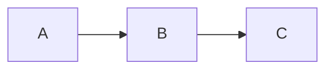

# dyno

A self-hosted documentation server — think GitBook or Notion, but as a single Go binary with zero external dependencies.

## Features

- **Markdown rendering** — GFM, footnotes, definition lists, syntax highlighting (200+ languages via Chroma)
- **Mermaid diagrams** — flowcharts, sequence diagrams, pie charts, and more
- **Full-text search** — built-in in-memory search with highlighted snippets
- **Auto-generated sidebar** — navigation tree built from the filesystem, no config needed
- **Light / dark mode** — persisted to localStorage
- **Table of contents** — per-page TOC with scroll spy
- **Prev / Next navigation** — automatic based on sidebar order
- **GitHub edit links** — "Edit this page" links pointing to your repo
- **macOS-style code blocks** — terminal chrome with syntax highlighting
- **Copy button** — one-click copy on every code block
- **Anchor links** — deep-linkable headings
- **Asset directories** — prefix a directory with `_` (e.g. `_images/`) to serve files without showing them in the sidebar
- **Configurable base path** — run under any URL prefix (e.g. `/docs`, `/myapp/docs`, or `/`)
- **Hot reload** — `--watch` flag reloads navigation and search index on file changes
- **Dev mode** — `--dev` flag reloads templates from disk without rebuilding
- **Single binary** — everything embedded, no Node.js, no build pipeline
- **Prebuilt production CSS** — Tailwind is compiled into local assets instead of loaded from a CDN

## Project layout

```
.
├── dyno.yaml          # Site configuration
├── site/              # Your Markdown content goes here
│   ├── index.md       # Landing page
│   ├── getting-started/
│   │   ├── index.md
│   │   ├── _images/   # Assets (underscore prefix = hidden from sidebar)
│   │   └── ...
│   └── ...
```

## Configuration

`dyno.yaml` in the project root:

```yaml
title: My Docs
description: Project documentation
version: 1.0.0
logo_text: MyProject
github_url: https://github.com/org/repo
github_branch: main
copyright: My Organization
base_path: /docs   # or "" for root
api_proxy_allowed_hosts:
  - api.example.com
api_proxy_allow_private_networks: false
```

All fields are optional — dyno works with no config file at all.

`api_proxy_allowed_hosts` limits the interactive API widget to an explicit host allowlist.
`api_proxy_allow_private_networks` controls whether the widget may call loopback/private targets; default is `true` for compatibility.

## Building

Requires **Go 1.22+**.

### Development

```bash
just css          # build production CSS once
just css-watch    # rebuild CSS while editing templates
go run . --dev --watch
go run . --version
```

### macOS

```bash
git clone https://github.com/mares/dyno
cd dyno
just release-macos
./dyno --dir /path/to/your/docs
```

Or install directly:

```bash
go install github.com/mares/dyno@latest
```

### Linux

```bash
git clone https://github.com/mares/dyno
cd dyno
just release-linux
./dyno --dir /path/to/your/docs
```

Cross-compile from macOS/Windows:

```bash
GOOS=linux GOARCH=amd64 go build -o dyno-linux-amd64 .
```

### Windows

```powershell
git clone https://github.com/mares/dyno
cd dyno
go build -o dyno.exe .
.\dyno.exe --dir C:\path\to\your\docs
```

Cross-compile from macOS/Linux:

```bash
GOOS=windows GOARCH=amd64 go build -o dyno-windows-amd64.exe .
```

## Usage

```
dyno [flags]

Flags:
  -p, --port string   Port to listen on (default "3000")
  -d, --dir string    Directory containing site/ folder (default ".")
      --dev           Reload templates from disk on every request
      --watch         Watch site/ for changes and reload navigation/search
      --log-format    Log format: text or json (default "text")
      --version       Print version and exit
```

### Examples

```bash
# Serve the current directory
dyno

# Serve a specific directory on port 8080
dyno --dir /path/to/docs --port 8080

# Development mode with live reload
dyno --dev --watch
```

## Writing content

Place Markdown files inside `site/`. The sidebar is built automatically from the directory structure.

- Directories become section headers
- Files become pages
- Prefix filenames or directories with a number to control sort order: `01-introduction.md`, `02-setup/`
- `index.md` inside a directory becomes the landing page for that section
- Directories prefixed with `_` are hidden from the sidebar but their files are still served (useful for images)

**Linking between pages:**

```markdown
[Relative link](../other-page/)
[Absolute link](/getting-started/)    <!-- base_path is added automatically -->
```

**Images:**

```markdown

```

**Mermaid diagrams:**

````markdown

````

**Environment placeholders in Markdown:**

Uppercase placeholders are expanded before rendering from:
- `./.env`
- `./site/.env`
- process environment variables

Process environment variables win over both `.env` files.

```markdown
API base URL: {{HTTPBIN_URL}}

```api
{{HTTP_METHOD_FOR_GET}} {{HTTPBIN_URL}}/get
```
```

Interactive API widget variables stay untouched when written in lowercase or mixed case:

```markdown
```api
GET {{HTTPBIN_URL}}/anything/{{userId}}
Authorization: Bearer {{token}}
```
```

In that example:
- `{{HTTPBIN_URL}}` is expanded before render
- `{{userId}}` and `{{token}}` remain editable in the widget UI

## License

MIT — see [LICENSE](LICENSE).
