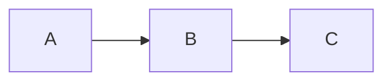

# dyno

A self-hosted documentation server — think GitBook or Notion, but as a single Go binary with zero external dependencies.

## Features

- **Markdown rendering** — GFM, footnotes, definition lists, syntax highlighting (200+ languages via Chroma)
- **Mermaid diagrams** — flowcharts, sequence diagrams, pie charts, and more
- **Full-text search** — built-in in-memory search with highlighted snippets
- **Auto-generated sidebar** — navigation tree built from the filesystem, no config needed
- **Light / dark mode** — persisted to localStorage
- **Table of contents** — per-page TOC with scroll spy
- **Prev / Next navigation** — automatic based on sidebar order
- **GitHub edit links** — "Edit this page" links pointing to your repo
- **macOS-style code blocks** — terminal chrome with syntax highlighting
- **Copy button** — one-click copy on every code block
- **Anchor links** — deep-linkable headings
- **Asset directories** — prefix a directory with `_` (e.g. `_images/`) to serve files without showing them in the sidebar
- **Configurable base path** — run under any URL prefix (e.g. `/docs`, `/myapp/docs`, or `/`)
- **Library mode** — serve multiple documentation sites under one dyno instance with repeated `--site`
- **Git-backed sites** — `--git-repo-site <url>` clones a repo and serves it; auto-pulls on a configurable interval
- **Document version compare** — compare any two Git revisions, the staged file, or the working tree in source and rendered views
- **Library config file** — `--library dyno-library.yaml` describes multiple sites (local or git) with metadata overrides
- **Backlinks** — every page shows which other pages link to it
- **Ego-graph** — D2 dependency graph (±1 hop) for each page, accessible via the graph icon in the navbar
- **Tasks** — collects `- [ ]` / `- [x]` task items across all pages; section-scoped and global views
- **Page comments** — optional local JSONL-backed comments for page-level and selected-text notes
- **Hot reload** — `--watch` flag reloads navigation and search index on file changes
- **Dev mode** — `--dev` flag reloads templates from disk without rebuilding
- **Single binary** — everything embedded, no Node.js, no build pipeline
- **Prebuilt production CSS** — Tailwind is compiled into local assets instead of loaded from a CDN
- **Optional MCP companion** — `dyno-mcp` exposes the same docs to AI agents over `stdio` or HTTP

## Project layout

```
.
├── dyno.yaml          # Site configuration
├── site/              # Your Markdown content goes here
│   ├── index.md       # Landing page
│   ├── getting-started/
│   │   ├── index.md
│   │   ├── _images/   # Assets (underscore prefix = hidden from sidebar)
│   │   └── ...
│   └── ...
```

## Configuration

### `dyno.yaml`

Per-site configuration file in the site root:

```yaml
title: My Docs
description: Project documentation
version: 1.0.0
logo_text: MyProject
github_url: https://github.com/org/repo
github_branch: main
copyright: My Organization
base_path: /docs        # or "" for root
# Git auto-pull (when site is cloned via --git-repo-site)
git_pull_interval: 5m   # or "false" to disable
git_branch: main
api_proxy_allowed_hosts:
  - api.example.com
api_proxy_allow_private_networks: false
content_include:
  - "docs/**/*.md"
  - "README.md"
content_exclude:
  - "**/drafts/**"
frontmatter:
  display: [document-status, document-owner, document-tags, updated]
  fields:
    document-status:
      label: Status
      type: select
      options: [NEW, DRAFT, REVISION, FINAL]
      filterable: true
    document-owner:
      label: Owner
      type: text
      filterable: true
    document-tags:
      label: Tags
      type: tags
    updated:
      label: Source updated
      type: datetime
      readonly: true
      update_on_save: true
```

All fields are optional — dyno works with no config file at all.

`api_proxy_allowed_hosts` limits the interactive API widget to an explicit host allowlist.
`api_proxy_allow_private_networks` controls whether the widget may call loopback/private targets; default is `true` for compatibility.

`content_include` and `content_exclude` limit which Markdown files are exposed in navigation, search, prev/next, and rendered pages. Patterns are slash-separated globs relative to the content directory; `**` matches across directories. Empty `content_include` means all Markdown files are included, and `content_exclude` always wins.

`frontmatter.fields` defines repository-specific metadata without hard-coding a vocabulary in Dyno. Supported types are `text`, `textarea`, `select`, `boolean`, `number`, `date`, `datetime`, and `tags`. `display` controls the preferred order, `readonly` prevents form edits, and `required` enables validation. For `date` and `datetime` fields, `update_on_save: true` writes the current server date or RFC 3339 timestamp whenever the document content is actually changed. Setting `filterable: true` adds a runtime facet to the sidebar, navigation, and full-text search in normal, edit, and library modes. Facet values and document counts are indexed at startup; values within one field use OR and different fields use AND. Filters are working views stored in the URL, not publication or access restrictions. Applying the editor form patches only changed top-level fields; unknown YAML and untouched complex blocks remain unchanged. The same `frontmatter` block can be configured per site in `dyno-library.yaml`.

### `dyno-library.yaml`

Describes a collection of sites for library mode. Use with `--library`:

```yaml
title: My Library
work_dir: ~/tmp/dyno-wrk   # writable dir for git clones (overridden by --work-dir)

sites:
  # local directory
  - path: ./local-site
    title: Local Docs
    slug: local
    icon: 📁
    color: "#6366f1"

  # git repo
  - url: https://github.com/org/devops
    title: DevOps Handbook
    slug: devops
    icon: 🚀
    color: "#f97316"
    branch: main
    pull_interval: 10m
    content_include:
      - "docs/**/*.md"
      - "README.md"
    content_exclude:
      - "**/drafts/**"

  - url: https://github.com/org/go-cookbook
    title: Go Cookbook
    slug: go
    icon: 🐹
    color: "#0ea5e9"
```

Each entry uses either `path` (local directory) or `url` (git repo), never both. Metadata fields (`title`, `slug`, `icon`, `color`, …) are fallbacks — `dyno.yaml` inside the site always wins.

**Priority:** `dyno.yaml` inside site > `dyno-library.yaml` entry > defaults.

## Building

Requires **Go 1.22+**.

### Development

```bash
just css          # build production CSS once
just css-watch    # rebuild CSS while editing templates
go run . --site ./site --dev --watch
go run . --site /path/to/wiki --dev --watch
go run . --version
go run ./cmd/dyno-mcp serve --transport stdio --site ./site
```

### macOS

```bash
git clone https://github.com/mares/dyno
cd dyno
just release-macos
./dyno --site /path/to/your/docs
```

Or install directly:

```bash
go install github.com/mares/dyno@latest
```

### Linux

```bash
git clone https://github.com/mares/dyno
cd dyno
just release-linux
./dyno --site /path/to/your/docs
```

Cross-compile from macOS/Windows:

```bash
GOOS=linux GOARCH=amd64 go build -o dyno-linux-amd64 .
```

### Windows

```powershell
git clone https://github.com/mares/dyno
cd dyno
go build -o dyno.exe .
.\dyno.exe --site C:\path\to\your\docs
```

Cross-compile from macOS/Linux:

```bash
GOOS=windows GOARCH=amd64 go build -o dyno-windows-amd64.exe .
```

## Usage

```
dyno [flags]

Flags:
  -p, --port string             Port to listen on (default "3000")
  -s, --site stringArray        Content directory (repeat for library mode) (default ["./site"])
      --git-repo-site string    Git repo URL to clone and serve as a site (repeatable)
      --work-dir string         Writable directory for git clones (required with --git-repo-site)
      --library string          Path to dyno-library.yaml with site list and metadata (cannot be combined with --site or --git-repo-site)
      --enable-comments         Enable page comments
      --comments-file string    JSONL file for comments (default: <site-root>/.dyno-comments.jsonl)
      --dev                     Dev mode: reload templates and assets from disk on every request
      --watch                   Watch site for changes and reload navigation/search (single-site only)
      --log-format string       Log format: text or json (default "text")
      --version                 Print version and exit
```

`--site` always points directly to the content directory, for example `./site` or `/path/to/wiki`.

`--library` is exclusive with `--site` and `--git-repo-site`: when you use a library file, define all books inside `dyno-library.yaml`. `--work-dir` may still be used to override the library file's `work_dir` for git-backed entries.

If a section directory has no `index.md`, dyno serves a synthetic landing page with links to child pages.

### Examples

```bash
# Serve one site
dyno --site ./site

# Serve a wiki directory directly
dyno --site /path/to/wiki --port 8080

# Library mode (multiple local sites)
dyno --site ./site --site ./site-demo-go

# Serve a git repo (cloned automatically, auto-pulled every 5 min)
dyno --git-repo-site https://github.com/org/docs --work-dir ~/tmp/dyno-wrk

# Library from a config file (local + git sites)
dyno --library dyno-library.yaml

# Development mode with live reload (single-site only)
dyno --site ./site --dev --watch

# Enable local comments
dyno --site ./site --enable-comments --comments-file ./comments.jsonl
```

Comments are an MVP feature. They are stored outside Markdown files in append-only JSONL. If an auth proxy sets `X-Auth-Request-User`, `X-Forwarded-User`, or `Remote-User`, dyno uses that as the author; otherwise the form author field is used.

## Writing content

Place Markdown files inside `site/`. The sidebar is built automatically from the directory structure.

- Directories become section headers
- Files become pages
- Prefix filenames or directories with a number to control sort order: `01-introduction.md`, `02-setup/`
- `index.md` inside a directory becomes the landing page for that section
- Directories prefixed with `_` are hidden from the sidebar but their files are still served (useful for images)

**Linking between pages:**

```markdown
[Relative link](../other-page/)
[Absolute link](/getting-started/)    <!-- base_path is added automatically -->
```

**Images:**

```markdown

```

**Mermaid diagrams:**

````markdown

````

**Environment placeholders in Markdown:**

Uppercase placeholders are expanded before rendering from:
- `./.env`
- `./site/.env`
- process environment variables

Process environment variables win over both `.env` files.

```markdown
API base URL: {{HTTPBIN_URL}}

```api
{{HTTP_METHOD_FOR_GET}} {{HTTPBIN_URL}}/get
```
```

Interactive API widget variables stay untouched when written in lowercase or mixed case:

```markdown
```api
GET {{HTTPBIN_URL}}/anything/{{userId}}
Authorization: Bearer {{token}}
```
```

In that example:
- `{{HTTPBIN_URL}}` is expanded before render
- `{{userId}}` and `{{token}}` remain editable in the widget UI

## dyno-mcp

`dyno-mcp` is a separate binary that exposes dyno documentation to AI agents over MCP while keeping the main `dyno` web server focused on HTML delivery.

Current design goals:
- one shared engine for both transports
- read-only tools only
- works in both single-site and library mode
- returns public dyno URLs so AI clients can surface clickable links back to the HTML docs
- exposes both MCP tools and MCP resources

### dyno-mcp usage

```bash
dyno-mcp serve [flags]
```

Flags:
- `-s, --site` repeatable, same semantics as `dyno`
- `--transport stdio|http`
- `--listen 127.0.0.1:8090` for HTTP mode
- `--path /mcp` for HTTP mode
- `--public-base-url https://docs.example.com`
- `--auth-token ...` or `DYNO_MCP_AUTH_TOKEN`
- `--allow-origin https://chat.example.com` repeatable in HTTP mode

Examples:

```bash
# Local stdio MCP for one site
go run ./cmd/dyno-mcp serve --transport stdio --site ./site

# Remote HTTP MCP endpoint for one site
go run ./cmd/dyno-mcp serve \
  --transport http \
  --site ./site \
  --listen 127.0.0.1:8090 \
  --path /mcp \
  --public-base-url https://docs.example.com

# Library mode MCP over HTTP
go run ./cmd/dyno-mcp serve \
  --transport http \
  --site ./site \
  --site ./site-demo-go/site \
  --listen 127.0.0.1:8090 \
  --path /mcp \
  --public-base-url https://docs.example.com
```

Implemented MCP tools:
- `list_books`
- `search_docs`
- `get_page`
- `get_navigation`
- `list_pages`
- `get_page_section`

Implemented MCP resources:
- `dyno://book/{slug}` — book metadata as JSON
- `dyno://book/{slug}/navigation` — navigation as JSON
- `dyno://book/{slug}/page?path=...` — raw Markdown for a page

HTTP compatibility notes:
- `POST` endpoint only for now; `GET` returns `405`
- returns `MCP-Protocol-Version: 2025-03-26`
- rejects unsupported `MCP-Protocol-Version` request headers with `400`
- when `--auth-token` or `DYNO_MCP_AUTH_TOKEN` is set, every HTTP request must send `Authorization: Bearer ...`
- when `Origin` is present, it must match one of the repeatable `--allow-origin` values

## License

MIT — see [LICENSE](LICENSE).
