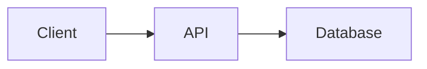

# Dyno Cookbook

Practical commands and copyable file examples, bundled with the binary.
No command below runs automatically. Replace example paths and URLs first.

Topics: browse, serve, edit, library, git, comments, config, markdown, mcp.
Show one topic with `dyno examples TOPIC`. Read all flags with `dyno --help`,
`dyno browse --help`, or `dyno-mcp serve --help`.
Save this guide with `dyno examples --markdown > dyno-examples.md`.

## browse

Read local Markdown without preparing a documentation site.

### Open a single document

```sh
dyno browse README.md
dyno browse './docs/Design discussion.md'
```

The document opens directly. Selecting a file does not expose all sibling
documents. To follow links to other documents, explicitly select those files
or their containing directory.

### Scan directories recursively and combine selections

```sh
dyno browse ./docs
dyno browse ./docs ./notes ./TODO.md
dyno browse
```

With no paths, the current directory is selected. Multiple paths are positional
arguments, not --file or --dir flags. The sidebar preserves directory names.
Overlapping selections are merged. Hidden entries, symlinks inside directories,
and common dependency/build directories are skipped during recursive scans.

### Exclude generated or archived documents

```sh
dyno browse . --exclude '**/archive/**' --exclude '**/generated/**'
```

Globs are relative to each selected directory; quote them so the shell does not
expand them. Explicitly selected files bypass recursive-scan exclusions.

### Choose a stable URL or disable browser launch and refresh

```sh
dyno browse ./docs --port 3001 --no-open
dyno browse ./docs --no-watch
dyno browse ./docs --edit --port 3001
```

Browse binds only to 127.0.0.1. By default it chooses a free port, opens the browser
and watches files. --no-open only disables browser launch, not the server.
--no-watch disables automatic refresh. Stop with Ctrl+C.
Links cannot silently expand the selected filesystem roots. Referenced images
and attachments are subject to the selection boundaries. Browse ignores
dyno.yaml and .pages publication rules and includes draft documents.

## serve

Serve a structured documentation site with navigation and full-text search.

### Minimal site

Create site/index.md containing a Markdown heading and some text, then run:

```sh
dyno --site ./site
dyno --site /path/to/wiki --port 8080
```

Default port: 3000. --site points to the content directory itself.
The server is network-accessible; unlike browse, it is not loopback-only.
Use a firewall or authenticated reverse proxy when publishing private content.
Configuration is optional. Section directories without index.md get a generated
landing page. Use 01-introduction.md and 02-installation.md to order navigation.
Keep images in _images/ and downloads in _downloads/.

### Development and structured logging

```sh
dyno --site ./site --watch
dyno --site ./site --dev --watch
dyno --site ./site --log-format json
dyno --version
```

--watch rebuilds navigation/search after changes (single-site only).
--dev reloads templates/assets from the source checkout; it is not required for
ordinary Markdown edits. Successful HTTP requests are not logged at INFO;
HTTP 4xx/5xx responses remain visible as warnings/errors.

## edit

### Edit a site or selected local documents

```sh
dyno --site ./site --edit --watch
dyno browse ./docs --edit
```

The editor has Contents | Visual editor | Live Preview panels. Use Source for
raw Markdown/front matter. Code blocks and callouts have dedicated edit dialogs.
Changes are written to the original files when saved. Keep a Git backup.
Revision checks guard against overwriting external changes.
Enable editing only for trusted local use: --edit is not an authentication layer.
For loopback-only editing, prefer browse --edit.

## library

### Several local sites, no configuration file

```sh
dyno --site ./engineering --site ./operations --port 3000
```

### A configured local and Git-backed collection

FILE: dyno-library.yaml

```yaml
title: Team Documentation
work_dir: ./dyno-work
sites:
  - path: ./engineering
    title: Engineering
    slug: engineering
    color: "#066fd1"
  - url: https://github.com/example/operations-docs.git
    title: Operations
    slug: operations
    branch: main
    pull_interval: 10m
    content_include:
      - "docs/**/*.md"
      - "README.md"
    content_exclude:
      - "**/drafts/**"
```

```sh
dyno --library ./dyno-library.yaml
dyno --library ./dyno-library.yaml --work-dir /tmp/dyno-clones
```

Each entry uses path OR url. Do not combine --library with --site or
--git-repo-site. --work-dir may override work_dir. Site-local dyno.yaml overrides
library metadata; library entry values override defaults.

## git

### Clone and serve a repository

```sh
dyno --git-repo-site https://github.com/example/docs.git --work-dir ./dyno-work
dyno --site ./local-docs --git-repo-site https://github.com/example/docs.git --work-dir ./dyno-work
```

--work-dir must be writable. Git-backed sites auto-pull every five minutes by
default. Configure branch and interval in the repository's dyno.yaml:

```yaml
git_branch: main
git_pull_interval: 10m
```

Use git_pull_interval: "false" to disable pulls. Configure credentials through
your Git/SSH environment, not passwords embedded in URLs.
Git history and version comparison are available for documents in Git repositories;
compare revisions, staged content and working-tree changes from the web UI.

## comments

### Enable comments and selected-text highlights

FILE: site/dyno.yaml (merge into existing configuration)

```yaml
comments:
  document_id_field: comment_id
```

FILE: site/architecture.md

```markdown
---
title: Architecture
comment_id: architecture-001
---
# Architecture

Select text to add a comment, highlight it, or copy it to the clipboard.
```

```sh
dyno --site ./site --enable-comments
dyno --site ./site --enable-comments --comments-file ./annotations.jsonl
dyno --site ./site --enable-comments --comments-management all
```

The default store is <site-root>/.dyno-comments.jsonl. Annotations are append-only
JSONL events, not changes to Markdown. Use stable unique document IDs.
Management defaults to disabled. "all" is explicit trusted local/admin access;
"author" requires trustworthy identity headers from an authenticated proxy.
Never trust user-supplied identity headers directly on a public server.

## config

### Site title, base URL prefix and publication filters

FILE: site/dyno.yaml

```yaml
title: Platform Handbook
description: Engineering and support documentation
logo_text: Platform
base_path: /docs
github_url: https://github.com/example/platform-docs
github_branch: main
content_include:
  - "docs/**/*.md"
  - "README.md"
content_exclude:
  - "**/drafts/**"
api_proxy_allowed_hosts:
  - api.example.com
api_proxy_allow_private_networks: false
```

With this base_path, open http://localhost:3000/docs/ after starting Dyno.
An empty base_path serves from /. Exclusions win over inclusions.
These settings apply to site/library mode, not browse.

### Metadata fields and sidebar facets

Add this block to dyno.yaml:

```yaml
frontmatter:
  display: [status, owner, updated]
  fields:
    status:
      label: Status
      type: select
      options: [DRAFT, REVIEW, FINAL]
      filterable: true
    owner:
      label: Owner
      type: text
      filterable: true
    updated:
      label: Updated
      type: datetime
      readonly: true
      update_on_save: true
  defaults:
    status: DRAFT
```

Document front matter then contains status: REVIEW and owner: Platform Team.
Facets are views, not access restrictions. Unknown metadata is preserved by edits.

## markdown

### Portable tables with document-level sorting and filtering

FILE: site/database.md

````markdown
---
title: Database
dyno:
  tables:
    sortable: true
    filter: true
---
# Database

| Property | Value |
| --- | --- |
| Database | app |
| Version | 17.6 |
````

The table stays standard Markdown for other renderers. Dyno adds column sorting
and case-insensitive substring filtering with matching-text highlights.

### Callouts and collapsible details

````markdown
> [!NOTE]
> A useful note.

> [!WARN]
> WARN is an alias for WARNING.

???+ tip "Deployment checklist"
    - [ ] Review configuration
    - [ ] Verify backups
````

Alerts: NOTE, INFO, TIP, IMPORTANT, WARNING, WARN, CAUTION, DANGER.
Use ordinary > quotes for quotations, not alert boxes.
MkDocs !!! blocks are supported; ??? is closed, ???+ starts open.

### Code and diagrams

````markdown
```sql
SELECT current_database();
```



```d2
client -> api -> database
```
````

Regular code fences render as code, not interactive API terminals.
Custom Dyno fences may appear as source code in other Markdown renderers.

### Interactive REST requests

````markdown
```api no-auth
GET https://api.example.com/status
```

```api
GET https://api.example.com/users/{{userId}}
Authorization: Bearer {{token}}
```
````

Lowercase/mixed-case variables are editable widget inputs. UPPERCASE placeholders
are expanded from .env, site/.env and process environment (process wins).
Never expose secret values through rendered documents.
Restrict destinations with api_proxy_allowed_hosts and private-network policy.
api-insecure disables TLS certificate verification for that widget only;
reserve it for deliberately trusted self-signed test endpoints.

### File downloads

Place the file at site/_downloads/reports/example.pdf, then write:

````markdown
```file-download
reports/example.pdf
```
````

Dyno renders a download card with filename, MIME type and size.
Paths are relative to the site's _downloads/ directory.

## mcp

The separate dyno-mcp binary provides read-only documentation access to MCP clients.

### Local stdio transport

```sh
dyno-mcp serve --transport stdio --site ./site
```

### Authenticated HTTP transport

```sh
export DYNO_MCP_AUTH_TOKEN='replace-with-a-long-random-token'
dyno-mcp serve \
  --transport http --site ./site \
  --listen 127.0.0.1:8090 --path /mcp \
  --public-base-url https://docs.example.com \
  --allow-origin https://chat.example.com
```

Use a TLS reverse proxy for remote access. The bearer token is required on every
HTTP request when configured. --allow-origin is repeatable; it does not replace
authentication. Tools include search_docs, get_page, get_navigation, list_pages,
list_books and get_page_section. This companion does not enable web editing.
