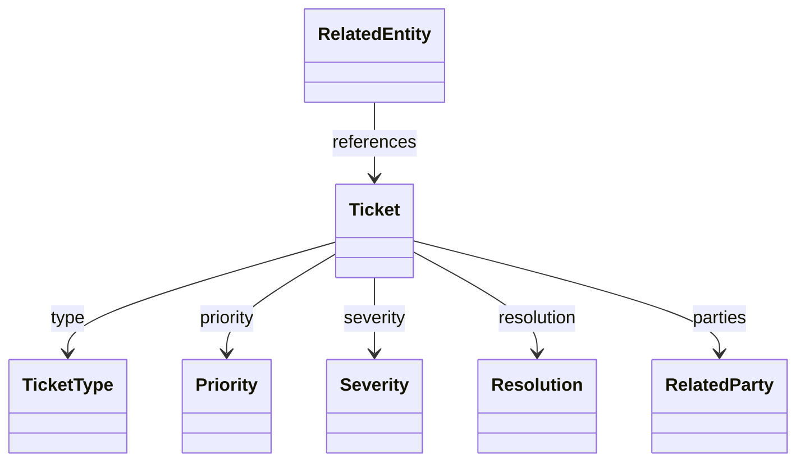
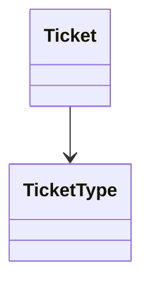

# Ticket model - Mermaid class diagram

Tahle stránka je migrovaná z modelového pohledu
`model/ticket/_Views/base-entities.md`. Původní diagram je výrazně větší, pro
demo site je zkrácený na hlavní vazby okolo ticketu.



## Poznámka ke kompatibilitě

Externí repo používá standardní Mermaid zápis:

````markdown

````

To je přesně formát, který Dyno podporuje. Renderer fence převede na
`<pre class="mermaid">...</pre>` a frontend ho následně vykreslí přes lokální
`assets/mermaid.min.js`.
