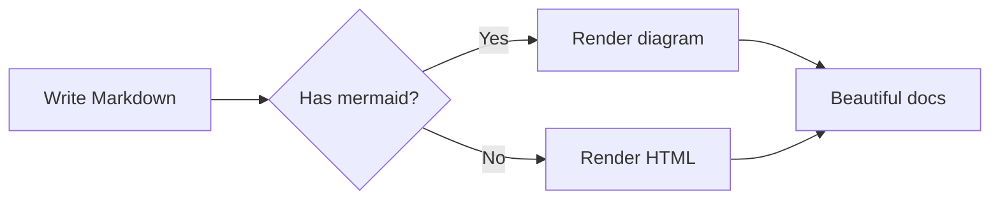

# Markdown Reference

Complete overview of all formatting options supported by dyno.

## Headings

```
# H1 — Page title
## H2 — Section
### H3 — Subsection
#### H4 — Detail
```

---

## Text formatting

| Syntax | Result |
|---|---|
| `**bold**` | **bold** |
| `*italic*` | *italic* |
| `~~strikethrough~~` | ~~strikethrough~~ |
| `` `inline code` `` | `inline code` |
| `**_bold italic_**` | **_bold italic_** |

---

## Lists

**Unordered:**

- Item one
- Item two
  - Nested item
  - Another nested
- Item three

**Ordered:**

1. First step
2. Second step
   1. Sub-step A
   2. Sub-step B
3. Third step

**Task list:**

- [x] Design the layout
- [x] Add dark mode
- [ ] Write tests
- [ ] Publish to production

---

## Links and images

```markdown
[Link text](https://example.com)
[Internal link](/getting-started/)

```

Images support click-to-zoom (lightbox).

---

## Blockquote

> This is a standard blockquote.
> It can span multiple lines.
>
> And multiple paragraphs.

---

## Callouts

> [!NOTE]
> Use `[!NOTE]` for general information that is helpful but not critical.

> [!INFO]
> Use `[!INFO]` to highlight extra context or background knowledge.

> [!TIP]
> Use `[!TIP]` for best practices or shortcuts the reader might find useful.

> [!WARNING]
> Use `[!WARNING]` when something could cause unexpected behavior.

> [!DANGER]
> Use `[!DANGER]` when something could cause data loss or irreversible damage.

**Syntax:**

```markdown
> [!NOTE]
> Your message here. Can span **multiple lines** and include `inline code`.
```

### MkDocs admonitions and details

Existing MkDocs/PyMdown documentation can use static `!!!` admonitions and collapsible `???` details. Add `+` to open a details block by default. Nested blocks are supported.

````markdown
???+ failure "Application must log"
    * Administrator activity
    * Security events

    !!! info "Included in the product :star:"
````

Supported types: `note`, `info`, `tip`, `success`, `warning`, `todo`, `danger`, `failure`, `cite`, and `tldr`. Superscript syntax such as `^4.1.8^` and common MkDocs emoji shortcodes are supported outside code.

---

## Code blocks

Inline: `const x = 42`

Fenced with language tag:

```go
package main

import "fmt"

func main() {
    fmt.Println("Hello, dyno!")
}
```

```typescript
interface User {
  id: number
  name: string
  email: string
}

const greet = (user: User): string =>
  `Hello, ${user.name}!`
```

```bash
go build -o dyno .
./dyno --dev --watch --port 3000
```

```yaml
title: My Docs
version: 1.0.0
base_path: /docs
github_url: https://github.com/org/repo
```

```json
{
  "name": "dyno",
  "version": "0.1.0",
  "features": ["search", "dark-mode", "mermaid"]
}
```

```sql
SELECT u.name, COUNT(d.id) AS doc_count
FROM users u
LEFT JOIN documents d ON d.author_id = u.id
GROUP BY u.name
ORDER BY doc_count DESC;
```

---

## Tables

| Feature | Supported | Notes |
|---|---|---|
| Markdown | ✅ | GitHub Flavored Markdown |
| Mermaid | ✅ | All diagram types |
| Search | ✅ | Full-text + substring |
| Dark mode | ✅ | Persisted to localStorage |
| PDF export | ❌ | Not planned |

Alignment:

| Left | Center | Right |
|:---|:---:|---:|
| apple | 🍎 | 1.20 € |
| banana | 🍌 | 0.80 € |
| cherry | 🍒 | 3.50 € |

---

## Footnotes

Dyno is built with Go[^1] and uses Goldmark[^2] for Markdown rendering.

[^1]: Go is an open-source programming language — https://go.dev
[^2]: Goldmark is a CommonMark-compliant Markdown parser — https://github.com/yuin/goldmark

---

## Definition list

Go
: A statically typed, compiled programming language designed at Google.

Markdown
: A lightweight markup language for creating formatted text using plain-text syntax.

HTMX
: A library that allows access to AJAX, WebSockets and CSS Transitions directly in HTML.

---

## Horizontal rule

Three dashes on their own line:

---

## Mermaid diagrams

See the [Mermaid Diagrams](/guides/mermaid-diagrams/) page for full examples. Quick sample:



---

## Emoji

Emoji work natively in Markdown — just paste them in:

🚀 Deploy · 🐛 Bug · ✅ Done · ⚠️ Warning · 🔥 Hot · 💡 Idea · 📖 Docs · 🔒 Security

---

## Inline HTML

For cases where Markdown is not enough, you can use raw HTML:

<details>
<summary>Click to expand</summary>

This content is hidden by default. Works with any HTML that the browser supports.

- List inside details
- Another item

</details>

<kbd>Ctrl</kbd> + <kbd>K</kbd> — open search

---

## Frontmatter

Every page can have optional YAML front matter at the top:

```yaml
---
title: My Page Title
description: Short description for SEO and search snippets.
weight: 10
draft: true
---
```

| Field | Description |
|---|---|
| `title` | Overrides the page title in sidebar and browser tab |
| `description` | Used in search result snippets |
| `weight` | Reserved for custom sort order (future) |
| `draft` | Set to `true` to hide the page from sidebar and search |
