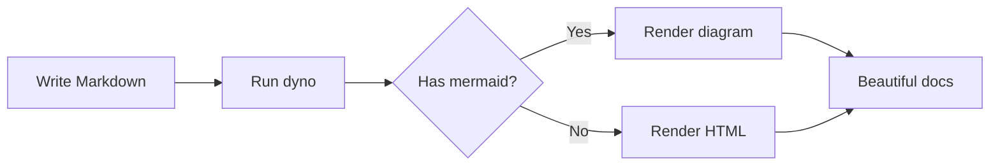
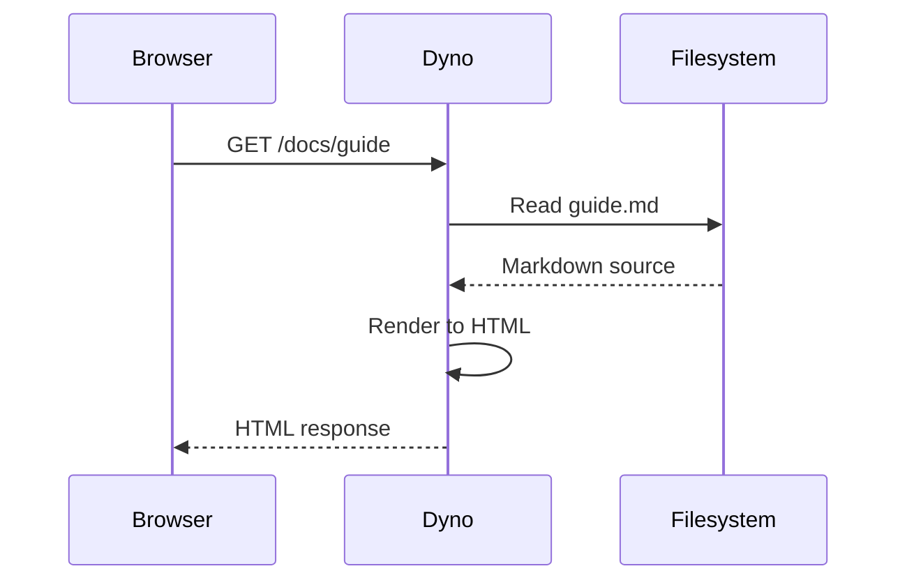
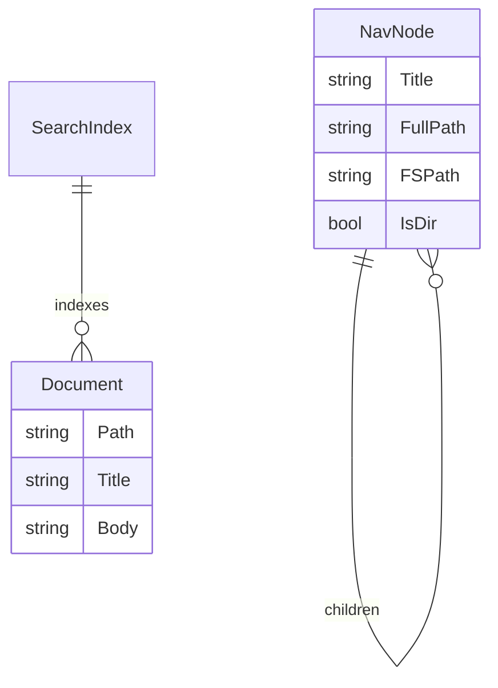
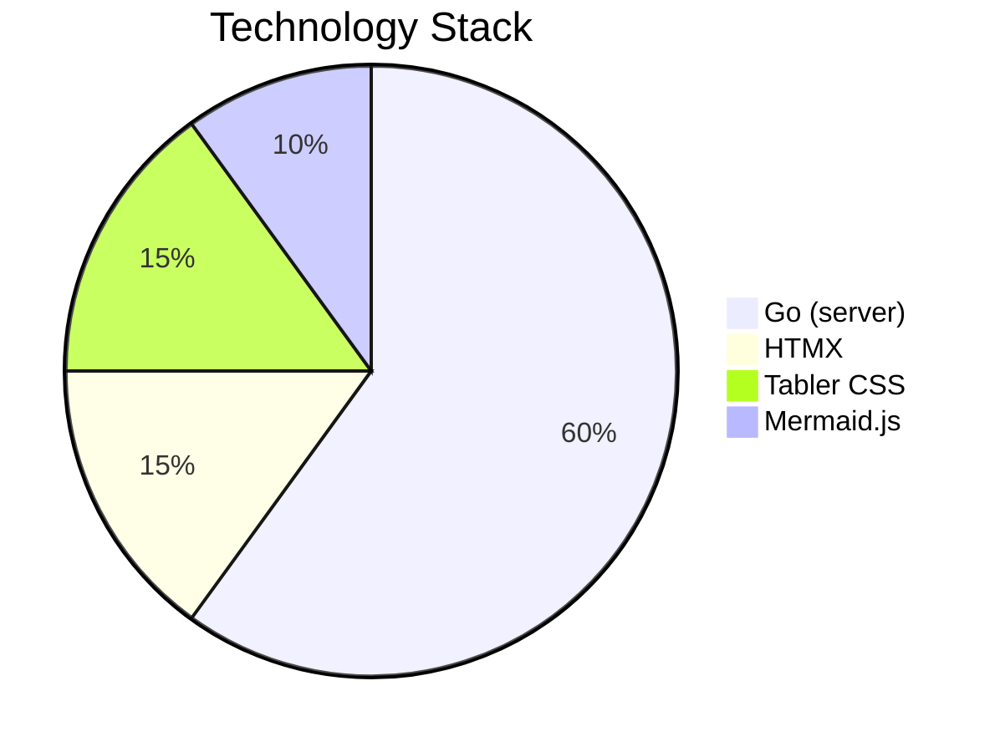

# Mermaid Diagrams

Dyno supports [Mermaid.js](https://mermaid.js.org/) diagrams out of the box. Just use a fenced code block with the `mermaid` language tag.

## Flowchart

## Sequence Diagram

## Entity Relationship

## Pie Chart

