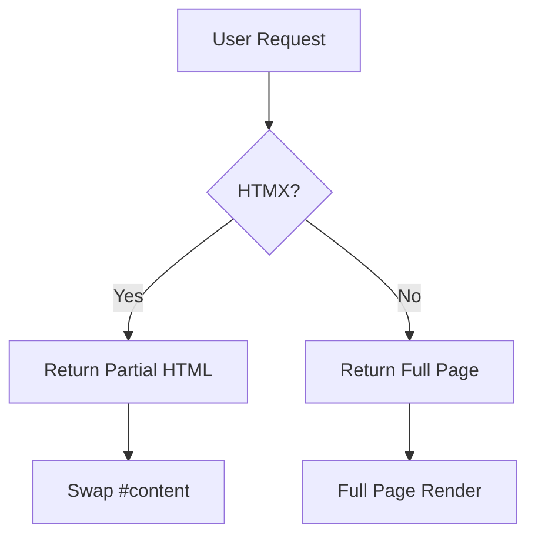

# Welcome to Dyno Docs

**Dyno** is a modern, self-hosted documentation server built with Go + HTMX + Tailwind CSS.

## Features

- **Fast** — single Go binary, zero runtime dependencies
- **Beautiful** — Tailwind CSS with dark/light mode
- **Searchable** — full-text search with highlighted results
- **Diagrams** — Mermaid.js support out of the box
- **Dynamic** — HTMX-powered navigation, no full-page reloads

## Quick Start

```bash
./dyno --dir /path/to/your/docs --port 3000
```

Browse to `http://localhost:3000` and you're done.

## Example Diagram



## Code Example

```go
package main

import "fmt"

func main() {
    fmt.Println("Hello, Dyno!")
}
```

> **Tip:** Use `Ctrl+K` to open search from anywhere.
